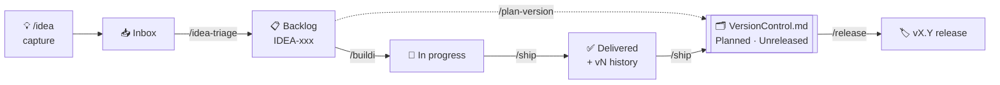

<p align="center">
  
</p>

<h1 align="center">Idea-Ledger</h1>

<p align="center">
  <strong>Capture ideas, track how each one evolves, and version what ships —<br>in nothing but plain Markdown.</strong>
</p>

<p align="center">
  
  
  
  
  
</p>

---

## What it is

**Idea-Ledger** is an installable [Claude Code](https://docs.claude.com/en/docs/claude-code) skill that turns two plain-Markdown files into a complete, friction-free product-management system. You capture ideas the moment they strike, develop and build them, and record what ships into versioned releases — without a database, a SaaS tool, or any dependency. The whole system is two files you can read, edit, and commit to your repo like any other source.

It's built around one simple, powerful invariant:

> **Nothing is ever deleted.** A shipped idea stays in the backlog forever, accumulating a version history (`v1`, `v2`, `v3`…). You can always return to any idea and add another iteration — and see at a glance how many times it was touched, and why.

## The two files

The system is a **pair** of files that live in a dedicated `Idea-Ledger/` folder, so anyone on the project knows exactly where to look:

| File | Answers | Tracks |
|------|---------|--------|
| **`Backlog.md`** | *"What's left to do, and how has each idea evolved?"* | Ideas (`IDEA-001`, `IDEA-002`…) with per-idea history |
| **`VersionControl.md`** | *"What has actually shipped, grouped into releases?"* | Releases (`v1.0`, `v2.0`, `v2.1`…) |

`Backlog.md` is what's missing plus per-idea history. `VersionControl.md` is what shipped — the state of the project at a glance.

## How it flows



Ideas come in the **front door** (`/idea-triage`) and deliveries go out the **back door** (`/ship`). Everything that ships lands somewhere, so nothing is ever uncounted — and `/release` is what turns shipped work, whether you planned it or it appeared from nowhere, into a real version number.

## Features

- 💡 **Frictionless capture.** `/idea <anything>` drops a note instantly — no forms, no interruption — so an idea is never lost mid-work.
- 🧠 **Smart triage.** Registration runs a duplicate check across *every* section (so you never rebuild something you forgot you had), assigns a stable ID, and writes the idea in your own voice.
- 🧬 **Evolution, not churn.** Improvements append a new `vN` line to the *same* idea — never a new entry. The count of `vN` lines tells you how many times it shipped.
- 🚦 **Dependency gating.** Build something whose prerequisite hasn't shipped, and the skill stops and warns you first.
- 🏷️ **Real versioning.** Forward-looking planned releases, an Unreleased buffer so nothing slips between versions, and `Major.Minor` release cuts — planned or ad-hoc.
- 🩺 **Self-checking.** `/ledger-check` audits the files for drift; `/status` gives a snapshot; `/changelog` exports clean release notes.
- 🔌 **Stack-agnostic.** Bookkeeping is always the job; running git (branch / commit / merge) is optional, configurable, and never happens without your explicit yes.
- 📄 **Just Markdown.** No database, no lock-in. Diff it, commit it, read it on GitHub.

## Commands

**Lifecycle**

| Command | What it does |
|---------|--------------|
| `/idea <text>` | Instantly capture a raw note to the Inbox. Safe to fire mid-work. |
| `/idea-triage` | Turn Inbox notes into registered ideas (dedup, ID, your voice, area, deps). |
| `/buildi IDEA-xxx` | Open an idea, check dependencies, move it to In progress, plan, and wait for your go-ahead. |
| `/ship IDEA-xxx` | Record a delivery: Delivered + dated `vN` line + a line in VersionControl. |
| `/plan-version` | Bundle chosen ideas into a forward-looking planned release. |
| `/release [IDEA-xxx]` | Cut a numbered `Major.Minor` version from shipped work — planned or ad-hoc. |

**Utility** *(read-only / export — they never change state)*

| Command | What it does |
|---------|--------------|
| `/status` | Snapshot: counts by state, in progress, blocked, unreleased, latest version. |
| `/ledger-check` | Audit both files for inconsistencies; reports, fixes only on request. |
| `/changelog` | Export user-facing release notes / `CHANGELOG.md` from the version history. |

The skill also responds to natural language — *"new idea: add a search bar"*, *"let's build IDEA-007"*, *"we shipped the export feature"* — so you don't have to memorize commands.

## Quick start

1. **Install the skill.** Copy the `idea-ledger/` folder into your project's `.claude/skills/` directory (or `~/.claude/skills/` to use it in every project).
2. **Install the commands.** Copy the files in `idea-ledger/commands/` into `.claude/commands/` for the short slash commands.
3. **Start using it.** In a Claude Code session, just say *"new idea: …"* or run `/idea …`. On first use in a project, the skill scaffolds the `Idea-Ledger/` folder and both files for you.

> No build step. Claude Code reads skills as plain folders.

## What it looks like in practice

A registered idea in `Backlog.md`:

```markdown
### IDEA-007 — Offline map downloads 🔴
- **Priority:** 🔴
- **Area:** maps
- **Registered:** 2026-06-23
- **Description:** download a region's maps before heading somewhere with no signal.
- **Dependencies:** [[IDEA-005]]
```

The same idea after it ships, in the Delivered section:

```markdown
### IDEA-007 — Offline map downloads ✅
- **Description:** download a region's maps before heading somewhere with no signal.
- **History:**
  - **v1** (2026-06-25) — bounding-box region download for offline use. _(PR #22)_
```

And in `VersionControl.md`:

```markdown
### v2.0 — Offline & export (2026-06-26)
Maps work without signal, and your data can leave the app.
- **IDEA-007** — offline region downloads.
```

## Customize

Everything is text you can change. Common tweaks: the branch-naming convention (`feat/IDEA-0xx-slug` by default), whether git execution is on at all (off by default), the ledger language (English by default — change one line), and the folder name. The rules and templates live in `SKILL.md` and `references/`.

## Origin & status

Idea-Ledger started as a **proof of concept** — a deliberately minimal experiment to answer one question: *can a genuinely useful, friction-free product-management workflow run on nothing but plain Markdown?* It can. The approach it validated here — stable IDs, never-delete history, the backlog/version-control pair, capture-before-triage — is the foundation being carried forward into **Agile-Ledger**, a more professional, Scrum-oriented successor.

Idea-Ledger remains the lightweight option: ideal for personal projects and small teams who want capture → plan → build → ship → version without ceremony.

## License

MIT — see [`LICENSE`](LICENSE).
